# Climate Advisor — Automation Flowcharts

This document provides visual decision-path references for every major control flow in the Climate Advisor automation engine. Each diagram reflects the actual source code logic in `coordinator.py`, `automation.py`, and `classifier.py`.

For data structures and coordinator internals see [docs/02-ARCHITECTURE-REFERENCE.md](02-ARCHITECTURE-REFERENCE.md).
For temperature formulas and threshold values see [docs/08-COMPUTATION-REFERENCE.md](08-COMPUTATION-REFERENCE.md).

---

## 1. Main Decision Loop (30-Minute Poll)

`_async_update_data()` runs every 30 minutes via `DataUpdateCoordinator`.

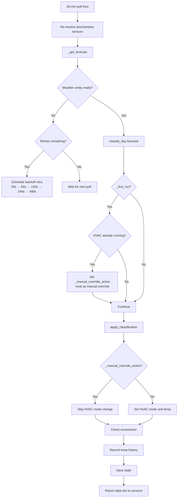

---

## 2. Classification Pipeline

`classify_day()` in `classifier.py` takes a `ForecastSnapshot` and returns a `DayClassification`.

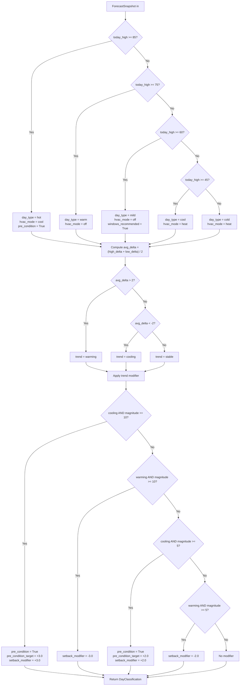

---

## 3. Daily Schedule

Four scheduled events fire each day via `async_track_time_change`.

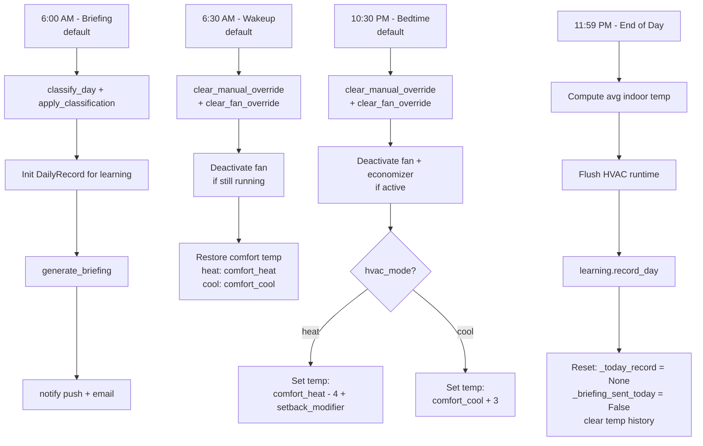

---

## 4. Door/Window Pause Flow

Sensor state changes are handled by `_async_door_window_changed()` in the coordinator, with pause logic in `handle_door_window_open()` and `handle_all_doors_windows_closed()` in the automation engine.

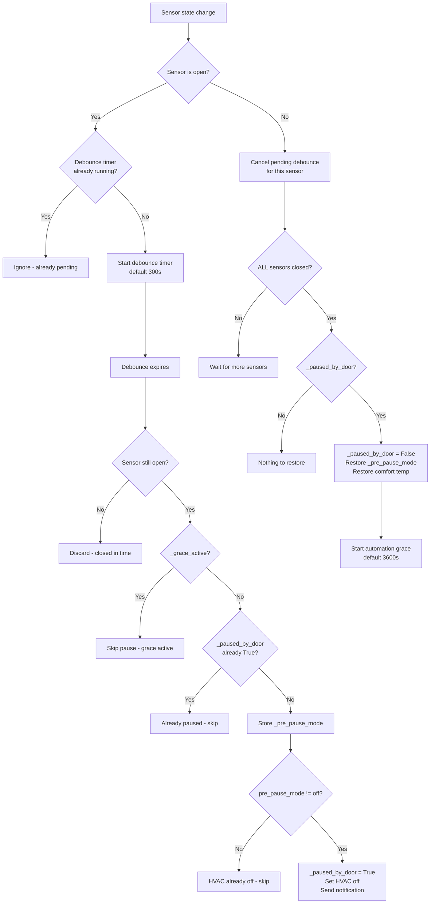

---

## 5. Manual Override Protection

Thermostat state changes are monitored by `_async_thermostat_changed()` in the coordinator.

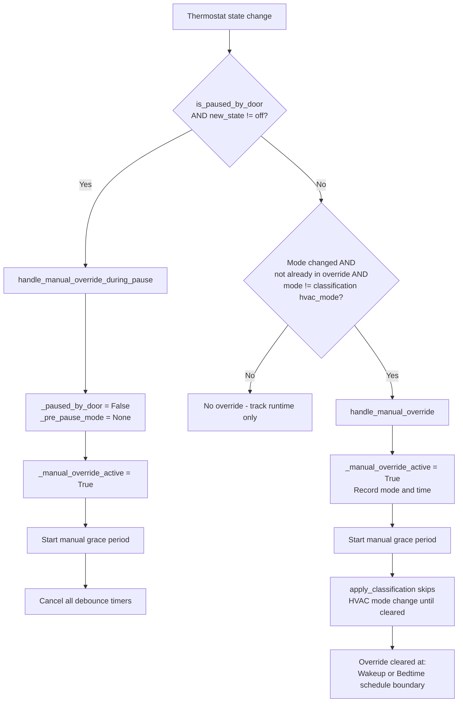

---

## 6. Fan Override Detection

Fan state changes are monitored by two listeners. A dedicated fan entity listener watches for direct on/off changes. The existing thermostat listener in `_async_thermostat_changed()` also detects `fan_mode` attribute changes. Both paths call `handle_fan_manual_override()` in the automation engine.

Fan override is tracked separately from HVAC override — `_fan_override_active` is independent of `_manual_override_active`. Both can be active simultaneously.

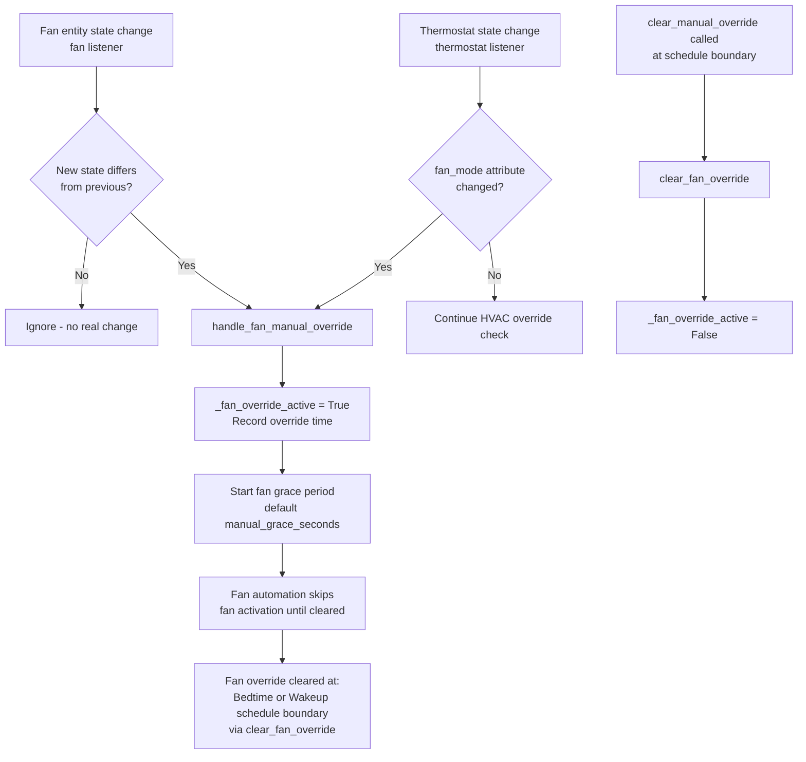

---

## 7. Fan Behavior at Schedule Transitions

Fan and economizer state are explicitly managed at the two main daily schedule boundaries: bedtime and morning wakeup. `clear_manual_override()` calls `clear_fan_override()` internally, so both override flags are cleared together at each boundary.

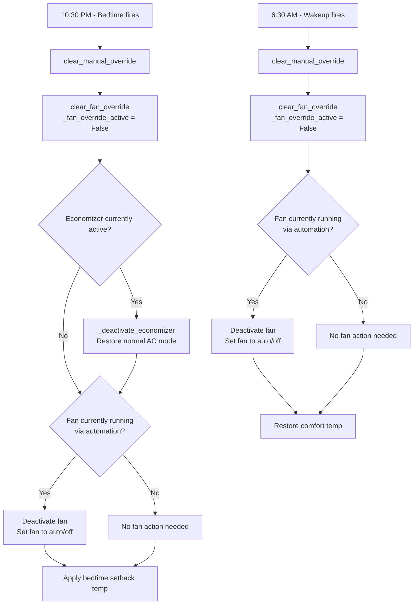

---

## 8. Grace Period System

Two grace period types are managed by `_start_grace_period()` in `AutomationEngine`.

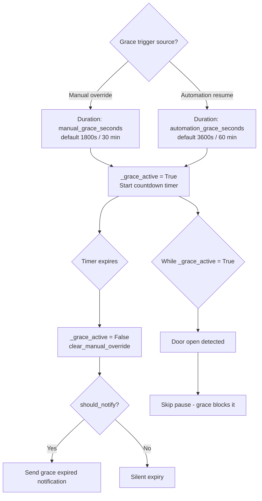

---

## 9. Occupancy State Machine

Four occupancy states with priority resolution via `_compute_occupancy_mode()` in the coordinator.

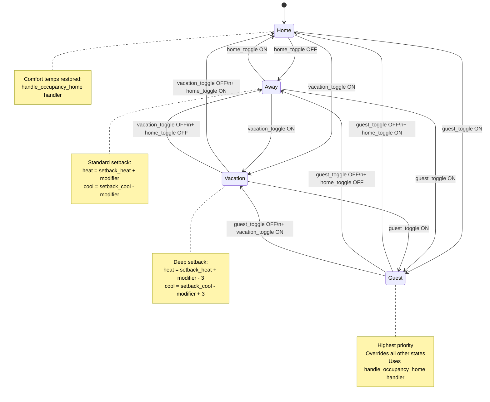

---

## 10. Economizer — Window Cooling on Hot Days

`check_window_cooling_opportunity()` in `AutomationEngine` implements a two-phase window cooling strategy.

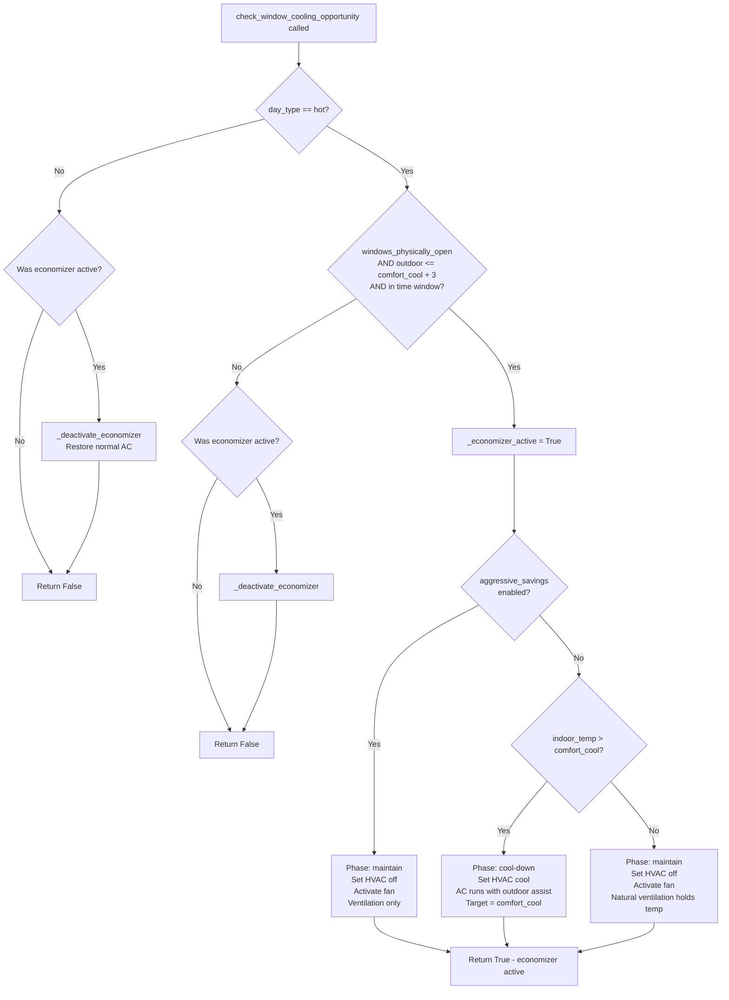

Time window check: morning 6:00–9:00 AM or evening 5:00 PM–midnight.

---

## 11. Startup Safety

First-run logic and weather entity backoff handled in `_async_update_data()`.

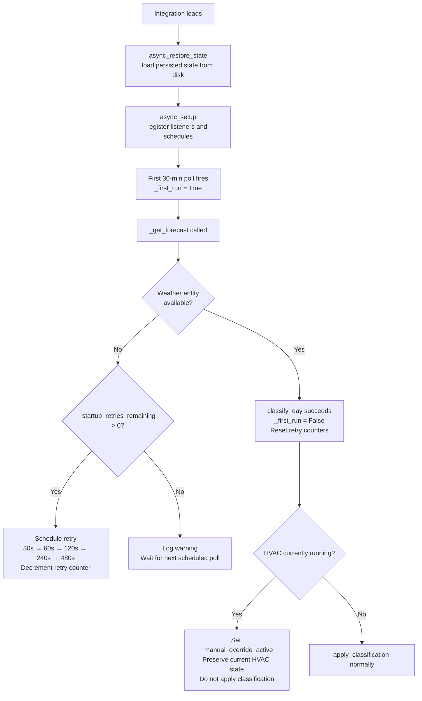

---

*Last Updated: 2026-03-20*
